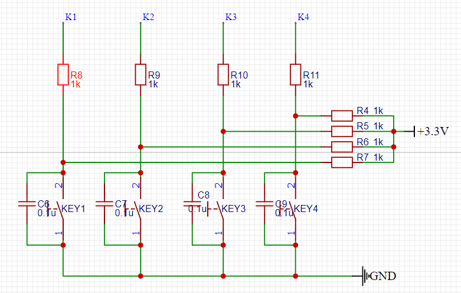
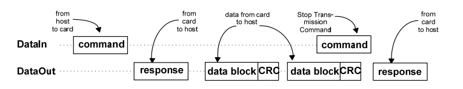

# DesignReport
<h1 id = '1'></h1>

[toc]

## 硬件设计

#### 1 总体设计
系统的整体设计如下图：PIC单片机与多个外设进行连接，通过SPI与存储模块SD卡进行通信，使用I2C向显示模块传输数据，使用I2C和I2S实现对音频模块的控制与音频的传输，并通过I/O控制灯带与按键，最终实现与玩家间的交互。

    
    
图1 系统设计架构

#### 2 外围电路
设置一个电源开关与一个复位开关。

    
    
图2 单片机外围电路

#### 3 模块设计
##### 3.1 显示模块
OLED屏幕的驱动芯片为SSH1106，其尺寸为1.3寸，显存大小为128*64，通过I2C与单片机进行数据的传输。其占用单片机2个I/O引脚，引脚说明如下图：

    
    
图3 OLED引脚说明

    
    
图4 显示模块电路连接

##### 3.2 存储模块
使用8G的MicroSD卡作为外部存储，MicroSD通过TF卡座与PIC单片机相连，使用SPI与单片机进行数据的传输。SPI占用单片机4个I/O引脚，且分别使用4个10K电阻进行上拉，引脚说明如下图：

    
    
图5 MicroSD卡引脚说明

    
    
图6 存储模块电路连接

##### 3.3 音频模块
选用WM8978音频解码芯片，它集成了DAC与功率放大器。PIC32通过I2C来控制WM8978，并通过I2S进行音频传输。扬声器选用的为耳机接口，故使用耳机座直接连接WM8978的左右声道输出，连接扬声器后用于播放音乐。I2C两个 引脚分别接10K电阻上拉，芯片的数字地和模拟地用一0欧姆电阻隔离，引脚说明如下图：

    
    
图7 WM8978引脚说明

    
    
图8 音频模块电路连接

##### 3.4 按键部分
选用4个机械按键实现用户交互。选择4个IO口连接4个机械按键，使用4个1K电阻进行上拉，按键按下时单片机的引脚为低电平。具体连接如下图：

    
    
图9 按键电路连接

##### 3.5 灯带部分
4根灯带共40个灯串联，占用单片机一个I/O口，通过PWM+DMA的方式控制，实现标志音符下落的效果。

    
    
图10 灯带电路连接

    
    
图11 灯带连接实物图

##### 3.6 其余部分
供电模块：通过Micro usb接口使用电脑进行5V供电，并使用AMS1117稳压芯片获得稳定的+3.3V电压

    
    
图12 供电模块电路连接

下载接口：使用pickit下载器进行代码下载与调试

    
    
图13 下载接口

##### 3.7 PCB部分
确定了上述模块以后，我们就可以进行PCB板的设计了。PCB板的尺寸为9.3cm*8.4cm，电气层规则设定为：孔外径0.4mm，孔内径0.3mm,元件最小间距0.152mm，线宽0.254mm。摆放时注意元器件之间的间距与相对位置，且由于器件较多，我们将部分元器件放在了底层，这样能提升布线的成功率。

    
    
图14 PCB效果图

#### 4. 硬件驱动设计
##### 4.1 I2C
I2C驱动对MPLAB Harmony已经提供的I2C的基本读写函数I2Cx_Write和I2Cx_Read（非阻塞式）进行了进一步的封装，包括提供了写单个字节和多个字节的接口，以及将非阻塞式调用更改为阻塞式调用以简化上层模块调用流程。同时在实际开发的过程中，发现PIC32MX256D的I2C2在硬件方式下不能正常工作，修改为软件模拟的方式后正常，因此I2C驱动向其他驱动同时提供了硬件和软件实现方式的接口。

    
    
图15 阻塞调用实现流程图

    
    
图16 硬件I2C接口

    
    
图17 软件I2C接口

##### 4.2 I2S
MPLAB Harmony提供的I2S驱动需要额外引入FreeRTOS，因此我们在Harmony提供的I2S Peripherals Library(仅初始化了相应的引脚和部分I2S的设置)上重新写了I2S的驱动，提供的接口如下：

    
    
图18 I2S接口

在项目中，I2S被单片机用来向WM8978发送音频数据，这一过程需要通过DMA完成。接口中I2S_Init用来完成相应DMA通道的初始化以及启动MCLK的输出，I2S_TxCallbackRegister则用来注册DMA传输完成的回调函数，而I2S_TransferSetup则用来使用户根据歌曲的量化位数、采样率、声道数动态修改I2S的配置，流程图如下：

    
    
图19 I2S_TransferSetup设置流程

##### 4.3 SPI
SPI驱动仅对MPLAB Harmony提供的I2S Peripherals Library做了一层简单的封装，以供MicroSD卡调用。由于MicroSD卡的驱动最先在STM32的平台上完成，为了方便地移植到PIC上，增加SPI驱动这一中间层，移植时向MicroSD保持的接口不变，重新实现SPI驱动里的相关函数即可。

    
    
图20 SPI接口

##### 4.4 KEY
KEY驱动为上层用到按键的模块提供服务，提供的接口如下：

    
    
图21 KEY接口

首先，驱动内部维护着以10ms为周期的TIM5定时器，定时对按键状态进行检测，即调用key_scan（软件消抖）或者key_scan_ex（无软件消抖，硬件上已做相关处理），并更新keyCtrl里的keyx变量为当前的按键状态。考虑到用户需要自行对按键状态进行额外的处理（不同游戏模式下同一按键的响应不同），驱动为用户提供了key_CallbackRegister用以注册自己的按键处理函数，该函数将会在TIM5的中断处理函数中更新完按键状态后被调用，流程图如下：

    
    
图22 按键处理流程图

Key_Init用于定时器和key_Ctrl的初始化，key_Start和key_Stop则分别通过控制定时器的开始/停止来启用/关闭按键功能。

##### 4.5 OLED
OLED驱动通过I2C控制屏幕特定像素点的亮暗，I2C格式如下：

    
    
图23 I2C总线数据格式

第一个字节为OLED屏幕在I2C总线上的地址，其中SA0由OLED模块上的跳线电阻决定，项目中OLED屏幕的7位地址为0x3C，第二个字节用以区分单片机向OLED屏幕发送的是数据(0x40)还是指令(0x00)，之后的字节则为要发送的内容。

    
    
图24 OLED page

项目中使用的OLED屏幕的显存大小为128*64，其中64又分为8个page，每个page的宽度为8个像素点。想点亮特定像素点时，先发送指令设置OLED的starting page和starting column，再之后发送的一个字节的8个bit则分别控制一个column的8个像素点的亮暗。发送一个字节后，RAM access pointer自动朝column增大的方向加一,因此连续发送多个字节可控制单个page内连续多列的显示。此为控制OLED屏幕的基本方法，在此基础上，结合提前写好的字模(drivers/OLED/codetab.h)可实现在OLED屏幕上显示指定的ascii字符；字符显示的起始垂直位置须和page的分界线对齐，通过位运算对字符进行裁剪，再多次设置starting page，可实现字符从任意的起始垂直位置显示。

    
    
图25 OLED I2C BUS时序图

驱动设计的另一个考量是屏幕刷新的速度问题。目前的OLED驱动使用的是硬件I2C，时钟频率为375.94kHz(MPLAB Harmony设置的是400kHz，实际与理论有出入)。考虑极限情况，即一次点亮所有像素点，软件上设置8次starting page，每次发送128个字节，需要29.53ms，肉眼可以察觉得到屏幕的闪动。但在实际使用的过程中，修改屏幕的部分区域更为频繁。测试一次清空2个page+显示一个数字，需要8.25ms，肉眼已察觉不到闪动，因此刷新速度基本满足实际需要。

    
    
图26 OLED接口

以上为OLED驱动向外提供的接口。OLED_Init会发送一连串指令完成OLED屏幕的初始化；OLED_Fill和OLED_FillArea分别用于以指定的内容填充全屏或指定区域；OLED_Show用于在任意区域显示指定的内容；OLED_ShowStr和OLED_ShowStrEx则都可用于显示字符，但前者y的范围为0-7，即字符的起始垂直位置位于page的分界线处，后者y的范围为0-63，即可任意指定字符的起始垂直位置。

##### 4.6 WM8978
WM8978驱动主要用于通过I2C设置WM8978的寄存器，提供的接口如下：

    
    
图27 WM8978接口

其中wm8978_Init主要用于调用wm8978_Reset以重置所有的wm8978寄存器值并复位wm8978。另外使用较多的包括wm8978_CfgAudioIF，设置wm8978使用的I2S标准和收到音频数据的量化位数；wm8978_CfgAudioPath，设置wm8978的输入输出通道，一般输入设置为DAC，即音频数据来自于CPU，输出可根据需要设置为耳机输出或扬声器输出；wm8978_SetOUT2Volume和wm8978_SetOUT1Volume则用于设置耳机输出或扬声器输出的音量。

##### 4.7 WS2812B
WS2812B采用PWM+DMA的方式驱动。WS2812B的控制首先要求单片机产生800kHz的PWM波，并可以修改每个周期的占空比。修改输出PWM的占空比可通过将值写入OC1RS寄存器实现，再利用DMA，将通道的触发源设置为控制PWM的定时器，每个PWM的周期结束时触发一次，将指定内存的值送到OC1RS内，即可修改每个PWM周期的占空比。

    
    
图28 WS2812B时序波形图

WS2812B驱动在能控制单个LED的基础上，实现对40个LED的控制。每个LED需要24bit数据，40个LED需要960bit数据。加上需要50us的低电平，刷新每一个LED的显示。而一个PWM的周期为1.25us，因此50us的低电平相当于40个周期占空比为0的PWM波，对应40bit的数据。因此控制40个LED并刷新显示共需要24*40+40=1000bit数据。而发送每bit数据需要1.25us，考虑发送LED数据前设置数据的时间，每次刷新40个LED数据的时间可以控制在2ms之内，且这1000bit数据靠DMA发送，不占用CPU。

    
    
图29 发送1000bit数据耗时

    
    
图30 WS2812B接口

以上为WS2812B提供的接口。WS2812B_Init完成DMA的配置，缓冲区的初始化和灯板上判定灯的显示；WS2812B_SendData用于启动DMA发送缓冲区的数据；WS2812B_FallALine用于控制灯的下落，传入一个大小为4个LEDProperty的数组，其中每个元素指定了灯的颜色，函数内则将当前每个灯下移一行，并把新加入的4个灯显示在最上面一行;WS2812B_SetJudgeLine则用于设置判定灯的颜色。

##### 4.8 MicroSD
MicroSD驱动负责使用SPI与SD卡通信，并向FatFs提供接口，使得文件系统得以访问SD卡。驱动提供的接口如下：

    
    
图31 MicroSD接口

其中箭头所指即为FatFS调用的接口。SD_Init依据以下状态机编写，完成卡的初始化。

    
    
图32 SD卡在SPI模式下的初始化流程

SD_ReadMultiBlocks参考的时序图如下：

    
    
图33 SD卡读多个block的时序图

基本的读写功能完成后，还有很重要的一点便是SD_ReadMultiBlocks的速度问题。项目中，播放音乐时，单片机需要从SD卡读取音频数据放到一个缓冲区内，再通过I2S将缓冲区内的音频数据发给WM8978。这一过程采用了双缓冲的形式，一个缓冲区用于收从SD卡读到的数据，另一个缓冲区用于发送数据给WM8978（具体流程会在软件实现的部分加上）。假设缓冲区大小为8192个字节，音频数据的采样率为44.1kHz，量化位数为16，则I2S将一个缓冲区内的音频数据发送完毕需要1/(44.1*10e3)*8192/4*10e3=46.44ms（除4是因为在一个左右声道切换的周期内，发送2个声道各16bit共4字节的数据）。因此单片机从SD卡读8192字节的音频数据的时间必须要小于这个值，否则I2S送到WM8978的数据就不是预想中的那样了。除此之外，在最后各部分合在一起后，在每一个46.44ms内，CPU除了从SD卡读数据之外，还需要完成按键检测和OLED屏幕的刷新，这对SD_ReadMultiBlocks的速度又提出了进一步的要求。以下为SD_ReadMultiBlocks的速度提升过程：

    
    
图34 SD卡读多个block耗时统计

此图为调用SD_ReadMultiBlock时不同block的耗时，16个block就是8192个字节。图中每条直线，斜率代表读一个block的耗时，截距则代表发送读的指令和读完后发送停止指令的耗时。图中的黄线即为当前项目中SD_ReadMultiBlock的实际表现，读取16个block的时间为12ms左右，基本满足实际需要。
  
到这里，我们的硬件驱动已经基本完成。软件开发只需要在适当位置，根据逻辑判断来调用合适的硬件驱动即可。(代码略)

## 软件设计

#### 1. 辅助模块设计
以下为项目的软件架构：

    
    
图35 项目软件架构

Drivers层已在前一部分说明。仅靠上述硬件驱动还不足以支撑起整个游戏，需要增加一些辅助的”application”。

##### 1.1 Music
音乐是项目中不可或缺的重要一环，无论游戏处于准备阶段还是开始阶段，都会有音乐播放，单独设立一个模块负责音乐的控制是非常有必要的。在游戏进行的过程中，音乐不是孤立存在的，需要和WS2812B进行协同，因此这一模块除了音乐的控制以外，还需要负责WS2812B的控制。

    
    
图36 Music接口

以音乐控制为例，设计的主要思路是，需要一个结构体记录当前音乐播放的状态，包括以双缓冲播放音乐时，两个缓冲区的地址和当前哪个缓冲区正在被使用；当前正在播放的音乐文件的句柄；音乐播放的状态、时长等等。提供的接口方面，music_Init函数负责与音乐有关的驱动的初始化，即WM8978和I2S；music_Start和music_Stop用于控制音乐播放的开始/停止，music_Play用于播放指定音乐文件前进行相关的初始化；music_buffer_fill用于缓冲区的填充，music_GetCurSec用于获取当前的播放进度，其中music_Play的流程图如下：

    
    
图37 Music_Play流程图

WS2812B与之类似，提供的接口如下：

    
    
图38 LED接口

设计思路与音乐控制部分接近，此不赘述。

##### 1.2 Screen
OLED驱动提供了在OLED屏幕上任意区域显示指定内容的接口，但最后需要OLED屏幕能够显示SD卡内的音乐文件名，音乐信息等等，这就需要再对OLED屏幕驱动做进一步的封装。Screen模块提供的接口如下所示：

    
    
图39 Screen接口

这一部分其实就是游戏UI的设计，下面直接以实物照片作为说明。先以pre mode为例：

    
    
图40 Pre mode UI，左边为文件列表，右边为当前选中歌曲的信息

    
    
图41 选择歌曲后弹出模式选择的对话框，选择具体的游戏模式

Game mode下，显示歌曲名称，歌曲进度，游戏分数等信息：

    
    
图42 Game mode UI

Play mode下，判定灯自动亮起，只显示歌曲进度和游戏分数：

    
    
图43 Play mode UI

##### 1.3 File
项目移植了FatFs作为SD卡的文件系统，移植的过程即利用MicroSD驱动提供的接口实现以下几个函数：

    
    
图44 移植FatFs需要实现的api

譬如disk_read会调用之前写好的SD_ReadMultiBlocks，disk_initialize会调用SD_Init，而项目中不需要用到RTC，故get_fattime则实现为返回固定时间戳。FatFs又为上层应用提供了以下接口：

    
    
图45 FatFs为上层应用提供的api

主要用到的api包括f_open，f_read等访问单个文件的接口，用于读取文件数据；还包括f_opendir， f_readdir等访问目录的接口，用于遍历文件目录以获取文件列表。读取文件数据由music模块的music_buffer_fill和Led_BufferFill负责，分别读取wav文件和mc文件。其中mc文件是自定义的文件格式，用于存储歌曲的bpm和对应的谱面数据，格式如下：

    
    
图46 .mc文件概览

    
    
图47 .mc文件格式说明

而为了方便用户通过FatFs提供的api访问SD卡里的文件，新增sdfile模块，封装了获取所有歌曲文件名，获取所有wav文件和mc文件的接口：

    
    
图48 Sdfile接口

其中的sdFile_Init则用于SD卡的挂载。最后整个File模块的软件架构如下所示：

    
    
图49 File模块结构说明

#### 2. 游戏设计
我们要完成的是一个音乐游戏。玩法具体来说，当音乐响起时，WS2812B灯带上的每个LED随着音乐的节奏下落，当LED落到底部的判定线时，玩家需要及时按下对应的按键，系统对玩家按下按键的时间是否在预定的区间内进行评判并记录相应的分数。

    
    
图50 WS2812B灯板

游戏设计的第一步，即需要完成谱面的设计。谱面是音游中的一个术语，即音乐游戏中音符(在我们的游戏中即点亮的LED)出现的次序。要编写一首曲目的谱面，首先要确定音乐的bpm（每分钟节拍数），以此确定音符落到判定线上的时刻，且音符落到判定线上的时刻应该和音乐中一拍中的小节对齐。举个例子，一首音乐的bpm为60，每一拍有四个小节，即一拍的时长为1s，每小节的时长为0.25s。音符需要在0.25s的整数倍时刻上落到判定线上，否则就会破坏音乐和灯光之间的节奏感，影响玩家的游戏体验（实际实现中几十ms这样玩家感觉不出来的误差是被允许的）。之后就可以着重考虑音符的次序了，这决定了一个谱面的优秀与否。从结合音乐的角度来讲，当歌曲旋律较为平稳是，音符出现的频率也较低，比如每两拍才出现一个音符；当歌曲旋律逐步加快时，音符出现的频率也要相应提高，比如每两个小节就出现一个音符，或者连续多个小节出现音符。好的谱面设计在符合音乐旋律变化的基础上，还需要把握音乐表达的情感。当音乐表达出的情绪有所波动时，玩家的情绪也随之起伏。玩家在听到一首很欢快的曲子时，手指的积极性会相应地提高，这时谱面的设计要加大音符出现的频率以满足这种积极性的提高，提高玩家的游戏体验。谱面的设计除了结合音乐外，还要考虑到游戏的难度，因此音符的出现需要充分调动玩家的双手，比如同一小节下有两列音符落下，下一小节变为另两列音符落下等。
由上可知，一首歌曲谱面的设计也是一种艺术创作，因此我们选择将别人已经写好的谱面移植到我们的项目中。下图为音乐游戏Malody内置的谱面编辑器

    
    
图51 Malody谱面编辑器

图中的蓝色横条即为音符，左边的数字为节拍的次序，可以看到一个节拍分为四个小节，音符刚好落在小节上。现在一项重要的工作是如何将谱面编辑器内的谱面快速导入到我们的项目中来。打开游戏文件夹内的谱面文件如下所示

    
    
图52 Malody谱面文件

可以看到文件内保存了谱面的元数据和音符(note)的信息。对一个note来说，beat [1,3,4]表示音符出现在一又四分之三拍上，column表示音符出现的列的位置。明确了谱面文件的内容后，可以写脚本解析并生成用于单片机控制LED下落的文件。比如第1拍的[1,0,1]和[1,3,4]两个音符，表现为

    
    
图53 自定义的.mc文件

在控制ws2812b下落时，单片机先把这样的数据读到缓冲区内。然后每次使灯下落时对数据的一行进行判断，为1则点亮对应列的LED，如此便可由Malody内的谱面文件控制项目中LED下落的次序。至此，项目中谱面来源的问题便解决了，且音乐同样可以取自Malody，将Malody所用的.ogg格式转换为.wav即可。

## 软硬件结合设计
游戏的主要流程图如图54所示。启动后游戏进入Pre mode，此模式下玩家可以选择想玩的曲目，并浏览相应曲目的bpm和时长等信息。选择曲目并选择模式后分别进入对应的模式。Game mode即为游戏模式，play mode则为演奏模式，此模式下当音符落到判定线上时，对应的判定灯会自动亮起。

    
    
图54 游戏主流程图

#### 1. 程序主循环 

    
    
图55 游戏模式控制流程图

#### 2. Pre mode

    
    
图56 Pre mode流程图

    
    
图57 Pre mode流程图

#### 3. Game mode

    
    
图58 Game mode流程图

    
    
图59 LED下落处理函数 和 屏幕刷新中断处理函数

在Game mode中，开启了以100ms为周期的tim3中断，并通过软件计数的方式，实现每过500ms刷新分数和每过1000ms刷新歌曲播放进度。另外一个值得讲述的地方就是LED_Queue和ANS_Queue的设计。LED_Queue是一个长度为9的队列，在队列满时使新元素入队，会使队列中最先入队的元素出队。这里的元素指的是每一行LED的状态。LED_Queue缓存了当前屏幕上的灯的状态，当队列满时，获取队列中最先入队的元素就可以很方便地获取到当前灯板上第9行LED的状态。Ans_Queue则缓存了当前灯板上第9行LED和前一次LED下落时第9行LED两行LED的状态，包括颜色和灯下落的时间，为后续对按键的判定做准备，下面来看按键判定的流程。

    
    
图60 Game key按键处理函数

在KEY的驱动设计中已经提到过，按键状态的更新由KEY驱动负责，上层应用可以注册自己的按键处理函数。Game key就是game mode向KEY驱动注册的按键处理函数。先检测按键是否处于按下状态，不是则判定灯保持不变；是的话则对当前ANS_Queue中的两行LED进行检查，如果是Note，即单个音符，判断当前按键是不是第一次按下，是的话则点亮判定灯；如果是Hold，即一连串连续音符中的第一个，不用判断按键是否第一次按下，直接点亮判定灯。不满足上述情况的判定灯都不亮。Greenhold设立的目的是为了判定成功后判定灯能够保持为绿一定的时间，否则会出现绿色一闪而过的现象。
碍于时间的因素，这个部分的设计并没有考虑得很全面，只是实际测试中对单个音符的判定基本满足完成游戏的需要。这个部分的难点在于如何设立判定条件使得玩家实际判断区间与设计区间相吻合，有待进一步考虑。
#### 4. Play mode

    
    
图61 Play mode流程图

    
    
图62 LED下落处理函数 和 屏幕刷新中断处理函数

Play mode的流程与game mode基本相似。自动判定的部分放在了play mode注册的按键处理函数中，只不过判定不需要依赖按键状态，直接依据ANS_Queue中灯的状态进行判定，实际效果也表现得很好，自动判定的流程图如下：

    
    
图63 Play key按键处理函数

[Back to top](#1)